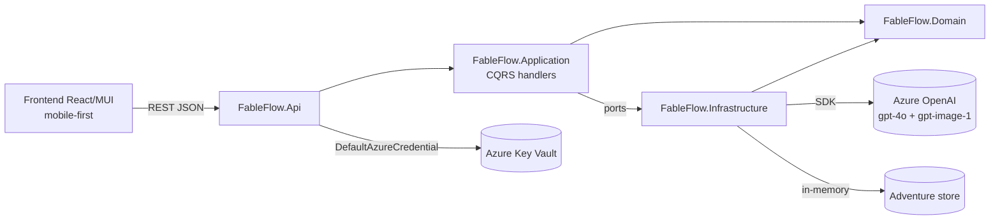
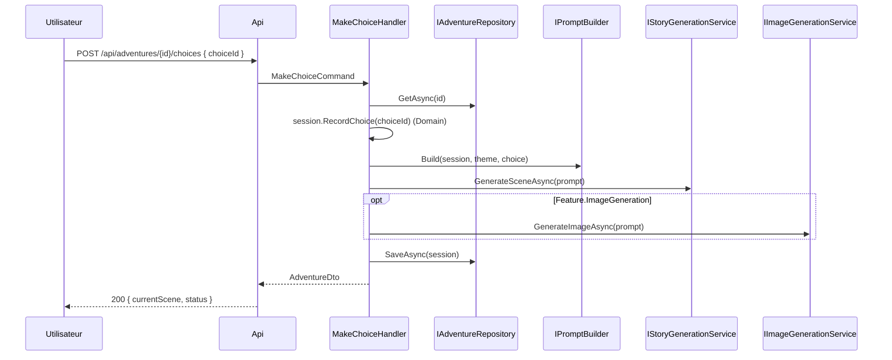

# Architecture — FableFlow

## Vue d'ensemble

FableFlow génère des aventures interactives scène par scène. Après chaque choix utilisateur, le backend appelle un LLM en conservant la **mémoire narrative** (résumé + état de session) pour garantir la cohérence globale.

## Couches backend

| Couche           | Rôle                                                                     | Dépendances                     |
| ---------------- | ------------------------------------------------------------------------ | ------------------------------- |
| `Domain`         | Entités, enums, logique narrative pure                                   | Aucune                          |
| `Application`    | CQRS (commands/queries + handlers), ports, DTOs, validation              | `Domain`                        |
| `Infrastructure` | Impl. des ports : Azure OpenAI, prompt builder, repository, theme policy | `Application`, `Domain`         |
| `Api`            | Endpoints HTTP, DI, config, Key Vault, observabilité                     | `Application`, `Infrastructure` |

## Flux « faire un choix »

## Modèle de session

- `AdventureSession` porte : thème, nombre de scènes cible, scène courante, `badChoiceCount`, statut (`InProgress`/`Won`/`Lost`/`Completed`), résumé courant, historique des scènes.
- Les transitions de statut sont **encapsulées dans le domaine** (`RecordChoice`, `Advance`, `Complete`).

## Endpoints

| Méthode | Route                          | Usage                                       |
| ------- | ------------------------------ | ------------------------------------------- |
| GET     | `/api/themes`                  | Thèmes disponibles                          |
| POST    | `/api/adventures`              | Démarre une aventure                        |
| GET     | `/api/adventures/{id}`         | État courant                                |
| POST    | `/api/adventures/{id}/choices` | Applique un choix, génère la scène suivante |
| GET     | `/api/adventures/{id}/history` | Scènes déjà jouées                          |

## Évolutions prévues

- Persistance durable (Cosmos DB / Azure SQL) derrière `IAdventureRepository`.
- Thèmes stockés côté backend / base de données derrière `IThemePolicyProvider`.
- Autres fournisseurs LLM / image derrière les ports existants.
